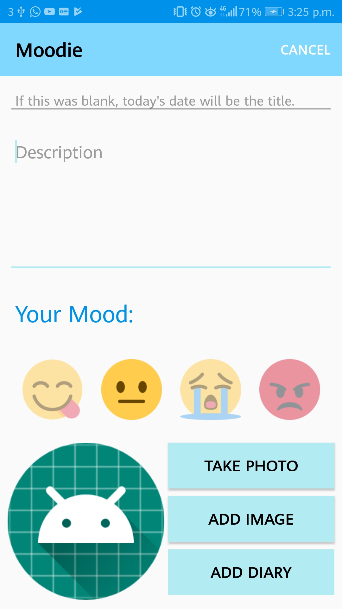
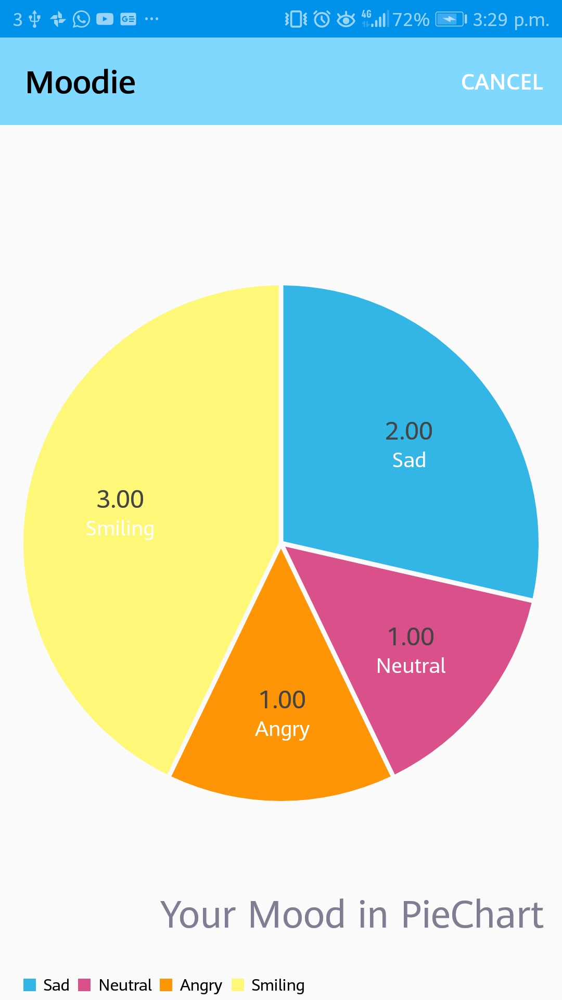
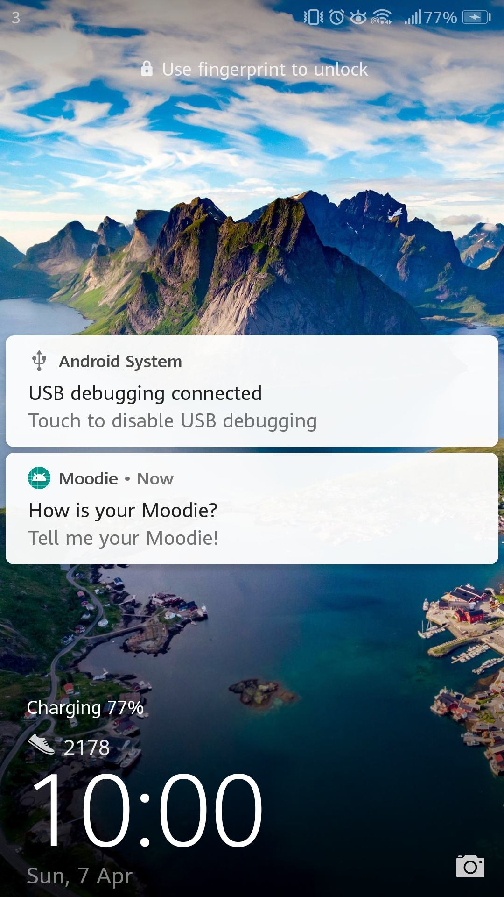
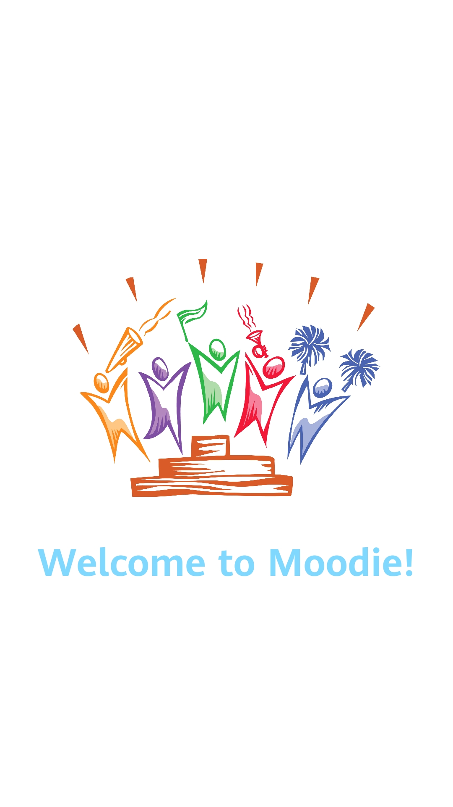

# Moodie 

## About
Moodie is a diary app (student project) allows you to not only perform basic CRUD function. It also displays your moods (happy, neutral, sad, angry) in a piechart. Users can also take photo and add it as part of their diary. Other than that, user will also received a notification at 10pm (GMT +8) everyday as a reminder to write diary.

## Naming
The reason why I named it as Moodie is because of the main feature of the diary app -- "Picking a mood in your diary". It is also a word play with the online educational platform used in WIT -- "Moodle".

## Inspiration
* [Daylio](https://daylio.webflow.io/) - The main inspiration of the apps. The features of mood picking of Moodie and displaying user's mood as a pie chart came from here. 

* [Duolingo](https://www.duolingo.com/) - the custom notification of Duolingo gives me the inspiration to send a notification as a reminder to the users of Moodie.

## Basic Functions
* The CRUD functions of Moodie are based on the [practicals](https://2018-2019.github.io/mobile-app/) done in class.
* The uses of RecycleView, ImageHelper and FileHelper are also based on the practicals.

## Extra Approaches
### Moods Picker
* As the main features of the app, 4 moods are provided to the user. The user and easily select one of the moods and change their mind at any time. These moods are stored in the json file as a String. To give the user a clear view of what they have picked, I do a toast message to tell them what they have picked and change the alpha(or opacity) to 1.0 which is opaque. The mood picked will also be shown in the DiaryListActivity as part of the recycle view. If the user did not pick any of the moods, a question mark will be shown in the recycle view. The images I have used as the mood are taken from [Emojipedia](https://emojipedia.org/people/) 

 
 
 

### Pie Chart
* [MPAndroidChart](https://github.com/PhilJay/MPAndroidChart) is used to provide a visual view of the user mood. This is done to allow the user analyse how are they doing so far. For example, if the pie chart is only showing the mood 'sad' and 'angry', the user is probably having a really bad time and when they look at the pie chart they will start thinking about it. To access to the pie chart, a pretty self-explaining icon is added to the toolbar of the app. For the icon, I use [svg image](https://material.io/tools/icons/?icon=alarm&style=baseline) so that it doesn't break the design of the app.

### Notification
*  [Firebase](https://console.firebase.google.com/u/0/) is used to send a daily reminder to the user at 10 pm. I find this is the most handy way as I only have to set up the connection to the firebase and I can handle all the notifications in the Firebase console. A google service file(not uploaded to GitHub due to security issues) is also downloaded in order to use this function.

### Getting Current Date and Time
* If the user did not provide a title for their diary, the current date will be set as the title of the diary. Users are also allowed to write their own custom title if they want to.

### Splash Screen
* A splash screen that last 1.5 second is created to welcome the user for using the app.

### Camera Features
* This app allows the user to have access to their phone camera instantly in the app. This is done to enhance the ease of use. The user doesn't have to leave the app and open their camera on their phone, take a picture and then switch back to the app to get the picture taken from the gallery. For pictures taken before, the app allow the user to get their picture from the gallery in the app.

## Built with
* Android Studio - the IDE used.
* Kotlin - the programming language used.

## User Experience Design
### Structure
* Simple - This app is designed to be simple. I try to include as least elements as possible in this app as I think with too much information provided to the user can cause distraction and heavily influence user experience.

### Colors
* Light Blue & White - I tend to use only this two colors with different shades. Again, this is because I wanted to retain the simplicity of the app. Furthermore, I think that the combination of blue and white gives a sense of comfortability. This is also used by many well-known applications such as [Twitter](https://twitter.com/?lang=en).

## Authors

* Teek Leng Ng (BSc in Software System Development Year 2 in WIT).

## Acknowledgments

* This app is built for academic purpose only. It is **NOT build for commercial purpose.** 
